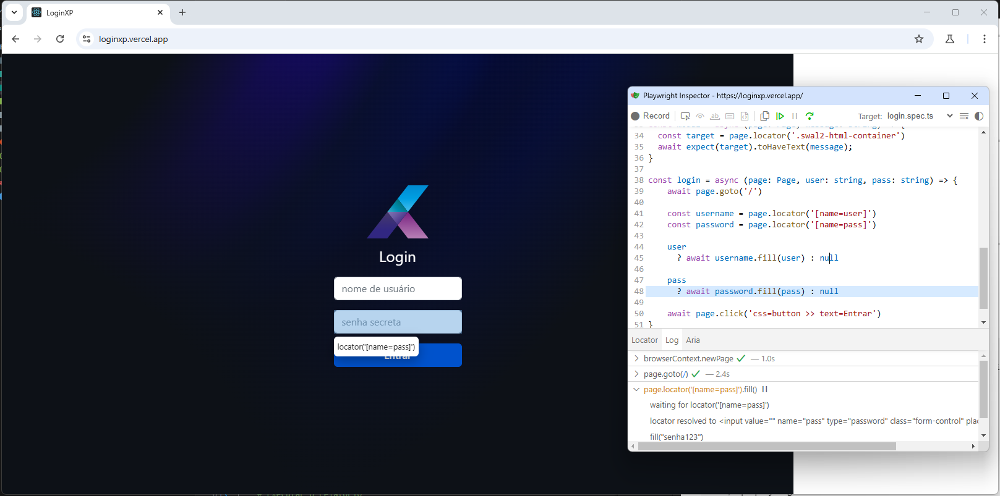

<div align="center">
  <h1 align="center">
    Workflow de testes contínuos em Playwright no Github Actions
    <br />
    <br />
    
    <br />
  </h1>

  <h2> 
  
  :white_check_mark: Projeto finalizado
  </h2>
</div>


---

# :file_folder: Índice 

- [Descrição do Projeto](#id01)
- [Ferramentas](#id02)
- [Desafio](#id04)
- [Instalação](#id03)

---

# :pushpin: Descrição do Projeto <a name="id01"></a>

Um workflow de testes contínuos em Playwright no GitHub Actions é um processo automatizado que executa seus testes de forma contínua (geralmente em cada push ou pull request) usando a infraestrutura de GitHub Actions.
Esse tipo de workflow permite garantir que seu código continua funcionando corretamente à medida que mudanças são feitas. Ele é bastante utilizado em projetos que aplicam CI (Integração Contínua).
Curso realizado no site Udemy pelo Fernando Papito

---

# :computer: Ferramentas<a name="id02"></a>

<div style="display: flex; gap: 10px;">
  
  
</div>

---

# 🎯 Desafio <a name="id04"></a>


---
# 🗂 Instalações <a name="id03"></a>
#### Baixar Projeto e instalações
```bash
    # Clonar o repositório
    $ git clone https://github.com/Amanda92Cortez/udemy-playwright-actions-papito.git

    # Entrar no diretório
    $ cd nomePasta

    # Instalar as dependências
    $ npm install

    # Executar o teste em Headless
    $ npx playwright test 

    # Executar o relatório
    $ npx playwright show-report
```

---

Feito pela Amanda Cortez 👋🏽 [Acesse meu linkedin!](www.linkedin.com/in/amandacortez92)